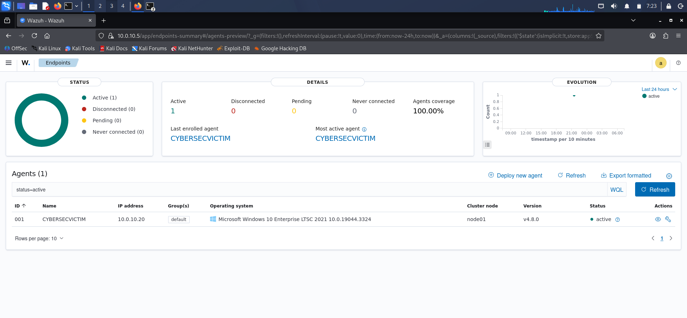
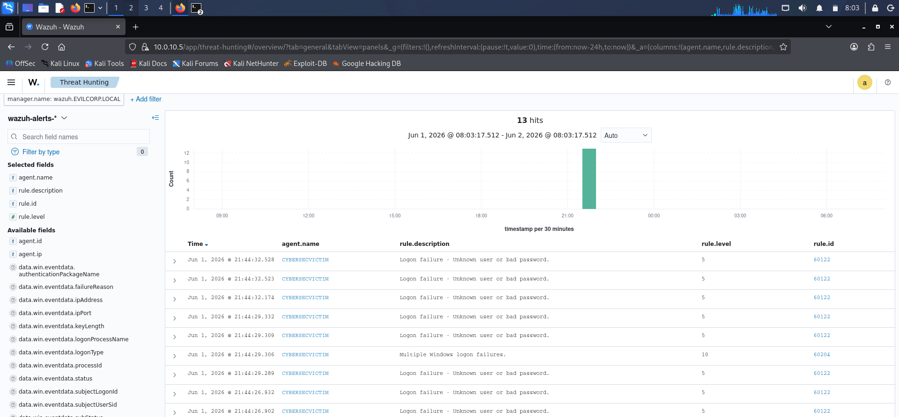
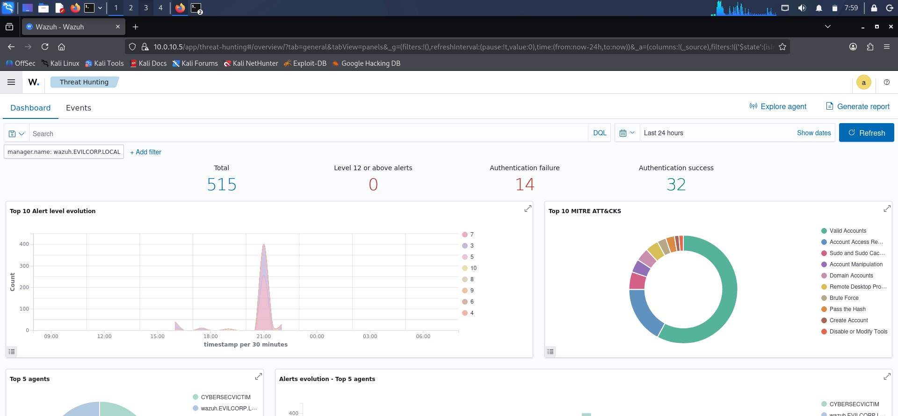

# SOC Detection Lab: RDP Brute-Force Attack Analysis

PREMISE: This is my first cybersec experiment ever, so feel free to help me with tips and suggestions. 

> **Lab Environment** - Intentionally vulnerable configuration deployed for threat detection research. Do not try this at home.

[[MITRE](https://img.shields.io/badge/MITRE-T1110%20%7C%20T1021.001-blue)](https://attack.mitre.org/techniques/T1110/)
[[SIEM](https://img.shields.io/badge/SIEM-Wazuh-orange)](https://wazuh.com/)
[[Status](https://img.shields.io/badge/Detection-Validated-success)](https://github.com)

## Objective

Engineer and validate SIEM detection coverage regarding RDP brute-force attacks. This lab demonstrates the full attack-defense lifecycle: from configuring a vulnerable Windows host, to simulating a brute-force attack, to analyzing telemetry and confirming high-severity alerting through Wazuh.

## Architecture

The lab architecture consists of a Windows 10 target (`CYBERSECVICTIM`), an AlmaLinux Wazuh server, and a Kali Linux attacker. PfSense acts as the network gateway/firewall. For the complete network topology, refer to the [network diagram](docs/NETWORK_ARCH_ILLUSTRATED.png).

## Detection Results

This lab managed to successfully generated and demonstrated the following security events on `2026-06-01`:

| Wazuh Rule ID | Description | Level | Count |
| --- | --- | --- | --- |
| 60122 | Logon failure - Unknown user or bad password | 5 | 12 |
| 60204 | Multiple Windows logon failures | 10 | 1 |

**Result**: The SIEM successfully correlated 12 failed login attempts from `CYBERSECVICTIM` and escalated to a Level 10 alert, thus indicating a confirmed brute-force pattern.

### Wazuh Dashboard Evidence

**1. Agent Telemetry Validation**
Endpoints summary confirming the `CYBERSECVICTIM` Windows 10 host is active and enrolled. With 100% agent coverage and IP `10.0.10.20` reporting to the Wazuh manager v4.8.0, this validates complete telemetry collection from the target machine for accurate detection engineering.

**2. Rule Correlation & Alert Generation**
Threat Hunting view showing 13 total hits during the attack. The timeline displays a burst of `rule.id 60122` Level 5 alerts for "Logon failure - Unknown user or bad password" followed by a single `rule.id 60204` Level 10 alert for "Multiple Windows logon failures". This shows that Wazuh successfully correlated 12 failed attempts and escalated to a critical alert.

**3. Attack Timeline & MITRE ATT&CK Mapping**
Security overview capturing the attack window around 21:00 on Jun 1, 2026. The "Top 10 Alert level evolution" graph shows a clear spike in Level 5 and Level 10 alerts. The "Top 10 MITRE ATTACKs" chart automatically maps the activity to `Brute Force` and `Remote Desktop Protocol`, proving the attack chain was correctly identified post-analysis. The 14 authentication failures confirm detection without system compromise.

## Methodology 

1. **Target Configuration**: Network Level Authentication was intentionally disabled on the Windows 10 host to simulate legacy systems. This forces RDP to use `LogonType 10` RemoteInteractive, generating distinct Event ID 4625 telemetry.
2. **Attack Simulation**: A brute-force attack was launched using Hydra, generating multiple failed authentication attempts.
3. **Telemetry Analysis**: Wazuh agent forwarded Windows Security Events to the manager. The query `data.win.system.eventID:4625 AND agent.name:CYBERSECVICTIM` confirmed the attack vector.
4. **Alert Validation**: Wazuh rule 60204 correctly triggered a Level 10 alert after correlating multiple 60122 events, validating the detection logic.

## Threat Analysis

The observed attack pattern and telemetry align with MITRE ATT&CK techniques. This mapping was performed post-analysis to contextualize findings within industry-standard frameworks:
- **T1110 Brute Force**: Adversary attempts to gain access by trying many passwords.
- **T1021.001 Remote Desktop Protocol**: Abuse of RDP for initial access.

## Tech Stack

- **Offensive**: Kali Linux, Hydra
- **Target OS**: Windows 10
- **Defensive**: Wazuh SIEM, Windows Event Viewer
- **Frameworks**: MITRE ATT&CK

## Skills Demonstrated

- Windows System Administration & Security Misconfiguration
- SIEM Engineering, Log Aggregation, and Rule Validation
- Threat Emulation & Adversary TTP Simulation
- Incident Detection, Analysis, and Reporting
- MITRE ATT&CK Framework Mapping

## Security Justification

I am aware that disabling NLA is considered bad practice, because it exposes systems to credential stuffing. It was used here to replicate vulnerable legacy systems still largely present in enterprise environments, and to generate the specific `LogonType 10` telemetry required for this detection use case. Production systems must have NLA enabled.
